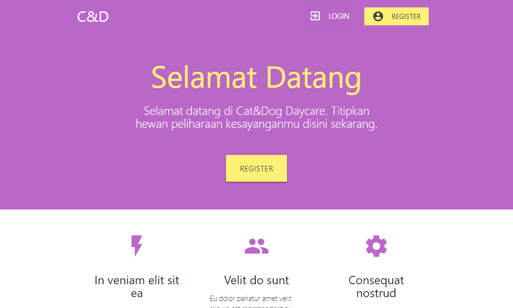

# PBKK-FinalProject
Final Project Mata Kuliah Pemrograman Berbasis Kerangka Kerja Kelas B Informatika ITS 2018/2019

## Cat&Dog Daycare

## Deskripsi 
Cat&Dog Daycare merupakan sistem informasi penitipan hewan kucing dan anjing.
Pengguna harus melakukan pendaftaran sebagai member terlebih dahulu sebelum menitipkan hewan peliharaannya disini.
Setelah mempunyai akun, pelanggan dapat mendaftarkan hewan peliharaannya dengan memasukkan informasi hewan, jadwal penitipan, dan metode pembayaran.


### Fitur-fitur untuk pemilik hewan :
- Mendaftar sebagai member
- Mengubah informasi pribadi
- Mendaftarkan hewan

### Fitur-fitur untuk resepsionis :
- Melihat data member
- Melihat dan mengubah informasi hewan yang dititipkan
- Melihat dan mengubah jadwal penitipan hewan
- Melihat dan mengubah status pembayaran


## USECASE DIAGRAM


## SITEMAP WEBSITE


## Tampilan Web
### Menu Utama


### Halaman Login


### Halaman Registrasi


```
Kelompok :
1. Irman Kurniawan         05111640000032
2. Kurniawan Adji Saputro  05111640000142
3. Maidina Choirun Nisa    05111640000176
```
